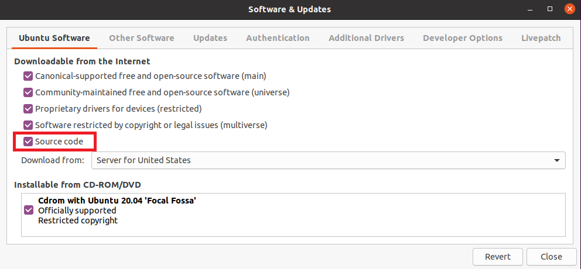

# HowTo-setup-a-YOCTO-Development-PC
1. install a Ubuntu 20.04 64 PC 
   1. if running in a VM, disable SECURE BOOT
   2. get `Ubuntu-20.04-desktop-amd64.iso` from https://ubuntu.com/download/desktop/thank-you?version=20.04.1&architecture=amd64  
   3. create a bootable USB stick from the ISO image: https://ubuntu.com/tutorials/create-a-usb-stick-on-windows#1-overview  

2. change screen resolution
   * `sudo vi /etc/default/grub`
   * add/replace `GRUB_CMDLINE_LINUX_DEFAULT="quiet splash video=hyperv_fb:1920x1080"`
   * `sudo update-grub`

3. enable source code updates
   * `sudo software-properties-gtk`
    
    
      
4. install YOCTO project in WSL / Ubuntu 20.04
    * `sudo apt-get install software-properties-common`
    * `sudo apt-add-repository universe`
    * `sudo apt-get update`
    * `sudo apt-get install --fix-missing`
    * `sudo apt update`
    * `sudo apt-get upgrade`
    * `sudo apt-get install gawk`
    * `sudo apt-get install wget`
    * `sudo apt-get install git-core`
    * `sudo apt-get install diffstat`
    * `sudo apt-get install unzip`
    * `sudo apt-get install texinfo `
    * `sudo apt-get install install-info info`
    * `sudo apt-get install gcc-multilib`
    * `sudo apt-get install build-essential`
    * `sudo apt-get install chrpath`
    * `sudo apt-get install socat`
    * `sudo apt-get install cpio`
    * `sudo apt-get install python3`
    * `sudo apt-get install python3-pip`
    * `sudo apt-get install python3-pexpect`
    * `sudo apt-get install python3-git`
    * `sudo apt-get install python3-jinja2`
    * `sudo apt-get install python3-distutils`
    * `sudo apt-get install xz-utils`
    * `sudo apt-get install debianutils`
    * `sudo apt-get install iputils-ping`
    * `sudo apt-get install libegl1-mesa`
    * `sudo apt-get install libsdl1.2-dev`
    * `sudo apt-get install pylint3`
    * `sudo apt-get install xterm`
    * `sudo apt install chrpath`
    * `sudo apt install libncurses5-dev`
    * `sudo apt-get install python3-distutils`
    * `sudo apt install gdb`

    * **`sudo dpkg-reconfigure dash`** <<-- choose **NO** to dash when prompted
    
    https://www.yoctoproject.org/docs/3.1.1/brief-yoctoprojectqs/brief-yoctoprojectqs.html
    
    
